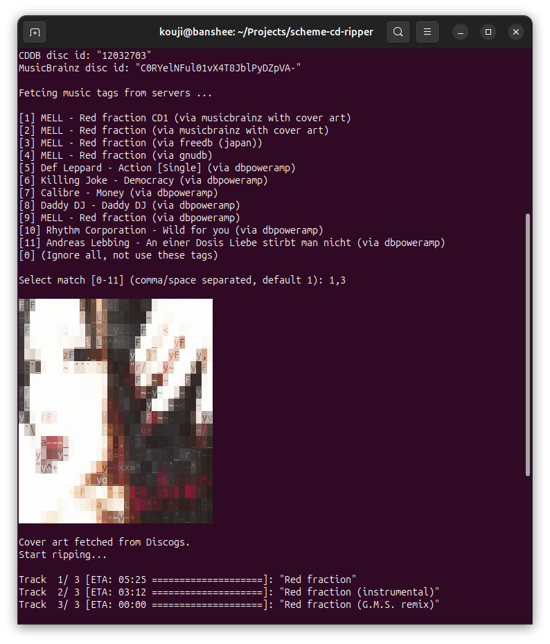
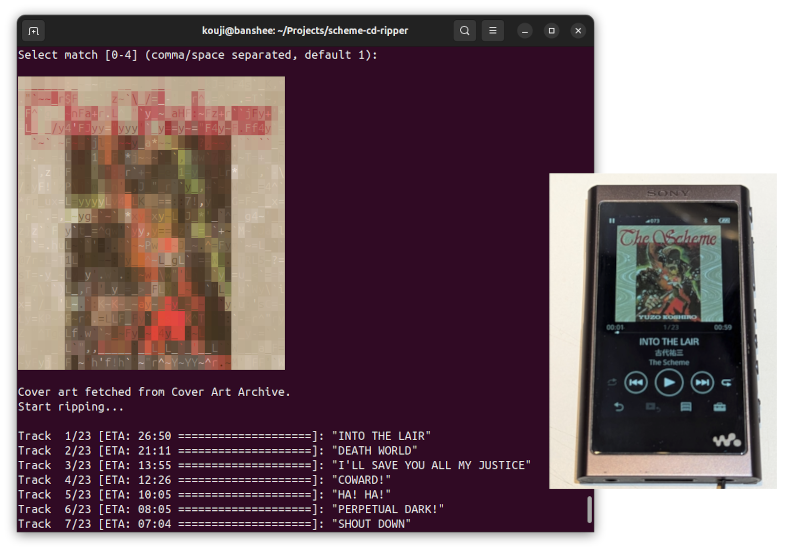
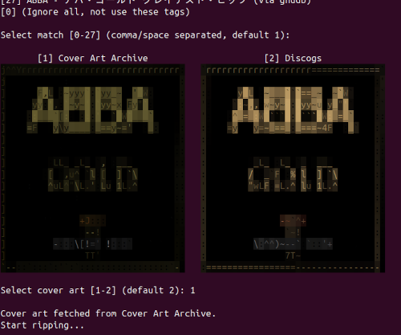

# Scheme CD music/sound ripper

Scheme CD Ripper is a linux CLI tool that rips audio CDs to FLAC.


[](https://www.repostatus.org/#active)
[](https://opensource.org/licenses/MIT)

Packages are available in (Debian/Ubuntu): https://github.com/kekyo/scheme-cd-ripper/releases

----

[(Japanese language is here/日本語はこちら)](./README_ja.md)

> Please note that this English version of the document was machine-translated and then partially edited, so it may contain inaccuracies.
> We welcome pull requests to correct any errors in the text.

## What is this?

Scheme CD Ripper is a linux CLI tool that rips audio CDs to FLAC, automatic fetches metadata from multiple CDDB servers and inserts tags into FLAC file.

This workflow is designed for processing large numbers of CDs continuously, for archiving usage.

### Features

- Encode and save audio tracks as FLAC while performing music stream integrity checks (with `cd-paranoia`).
- Reads the disc TOC, queries multiple CDDB servers and MusicBrainz. Merges all matches, and prompts you to pick a candidate.
- Inserts Vorbis comments (ID3 like tags in FLAC format) automatically.
  Furthermore, if a cover art image exists at Discogs/CAA, it can be automatically embedded.
  And, the flexible metadata auto-search feature and candidate regular expression filters reduce the burden of automatic tagging.
- File names and directories can be automated using your specified format with tags.
- And since it uses GNOME GIO (GVfs) for file output, you can output directly to a NAS or similar device using a URL.
- Supports continuous mode for efficient operation of multiple CDs.



-----

## Installation

For Debian (trixie, bookworm) / Ubuntu (24.04, 22.04), [prebuilt binaries are available here](https://github.com/kekyo/scheme-cd-ripper/releases).
There are two packages available (`cdrip.deb`, `libcdrip-dev.deb`), but if you only need to use `cdrip` command, installing just the first one is sufficient.
The second one is an API library for C language when you want to use this feature.

For environments other than those listed above, you can build it yourself. In that case, please refer to [Self Building](https://github.com/kekyo/scheme-cd-ripper#self-building).

## CLI Usage

Simply run the `cdrip` command, and it will detect your PC's CD drive and start working.
Ripped FLAC files are stored in subdirectories under the album name, created within the current directory:

```bash
cdrip
```

The default options are configured for easy use of cdrip.
Of course, you can adjust them to your preferences as follows:

```bash
cdrip -d /dev/sr1 -f "{artist:n/title:n}.flac" -r
```

The following are the options:

- `-d`, `--device`: CD device path (`/dev/cdrom` or others). If not specified, it will automatically detect available CD devices and list them.
- `-f`, `--format`: FLAC destination path format. using tag names inside `{}`, tags are case-insensitive. (see below)
- `-m`, `--mode`: Integrity check mode: `best` (full integrity checks, default), `fast` (disabled any checks)
- `-c`, `--compression`: FLAC compression level (default: `auto` (best --> `5`, fast --> `1`))
- `-w`, `--max-width`: Cover art max width in pixels (default: `512`)
- `-s`, `--sort`: Sort CDDB results by album name on the prompt.
- `-ft`, `--filter-title`: Filter CDDB candidates by title using case-insensitive regex (UTF-8)
- `-nr`, `--no-recrawl`: Disable MusicBrainz recrawl from CDDB titles.
- `-r`, `--repeat`: Prompt for next disc after finishing.
- `-ne`, `--no-eject`: Keep disc in the drive after ripping finishes.
- `-a`, `--auto`: Enable fully automatic mode (without any prompts).
  It picks the first drive that already has media, chooses the first CDDB match, and loops in repeat mode without prompts.
- `-ss`, `--speed-slow`: Request 1x drive read speed when ripping starts (default).
- `-sf`, `--speed-fast`: Request maximum drive read speed when ripping starts.
- `-g`, `--replaygain`: Enable ReplayGain tagging (default).
- `-ng`, `--no-replaygain`: Disable ReplayGain tagging and save each track immediately as before.
- `-dc`, `--discogs`: Discogs cover art preference: `no`, `always` (default), `fallback`.
  In interactive mode, this also controls the default choice when both Discogs and CAA cover art candidates are available.
- `-na`, `--no-aa`: Disable cover art ANSI/ASCII art output.
- `-l`, `--logs`: Print debug logs.
- `--permissions <ugo>`: Set output permissions as a 3-digit octal file mode such as `664`. Ignored by `--update`.
- `--permission-warnings`, `--no-permission-warnings`: Show or hide warnings when output permission adjustment fails. Ignored by `--update`.
- `--tag`, `--tags <key=value>`: Override a Vorbis comment tag for normal ripping. Repeatable, ignored by `--update`.
- `-i`, `--input`: cdrip config file path (default search: `./cdrip.conf` --> `~/.cdrip.conf`)
- `-u`, `--update <file|dir> [more ...]`: Update existing FLAC tags from CDDB using embedded tags (other options ignored)

Command-line options with config counterparts (except `-u` and `-i`) can override the contents of the config file specified with `-i`.

When ReplayGain is enabled, all tracks are ripped into a temporary directory first. The final `.flac` files do not appear in the destination until the whole album has finished ripping and ReplayGain tags have been written.

TIPS: If you want to import a large number of CDs continuously with MusicBrainz tagging, you can do so by specifying the `cdrip -a -r` option.
Additionally, when ripping CDs from the same series, using the `-ft` option to narrow down the titles somewhat can reduce mistakes in selecting CDDB candidates.

TIPS: Some hardware media players malfunction when the compression level is set to 6 or higher. Therefore, the default for Scheme CD ripper is set to 5.

## Inserting CDDB Tags

You can automatically retrieve track information from CDDB servers or MusicBrainz to automatically apply track names or add Vorbis comments (similar to ID3 tags in FLAC).

You can also merge information from multiple CDDB servers. Specify one or more candidates separated by commas or spaces.
The candidate with the first specified number takes precedence, followed by subsequent ones.
The genre tag (`genre`) is automatically merged.

The following example applies candidates 3 and 12 in sequence:

```bash
Fetcing from CDDB servers ...

[1] BarlowGirl - For the Beauty of the Earth (Studio Series) (via freedb (japan))
[2] Bomani "D'mite" Armah - Read a Book Single (via freedb (japan))
[3] Stellar Kart - Angel In Chorus (Studio Series) (via freedb (japan))
[4] Disney - Shanna (via dbpoweramp)
[5] Ladina - Verbotene Liebe (via dbpoweramp)
[6] Across The Sky - Found By You [Studio Series]  (2003) (via dbpoweramp)
[7] Bomani "D'mite" Armah - Read a Book Single (via dbpoweramp)
[8] Cuba Libre - Sierra Madre (via dbpoweramp)
[9] Big Daddy Weave - You're Worthy Of My Praise(Studio Series) (via dbpoweramp)
[10] BarlowGirl - For the Beauty of the Earth (Studio Series) (via dbpoweramp)
[11] Crossroads - Unknown (via dbpoweramp)
[12] Stellar Kart - Angel In Chorus (Studio Series) (via dbpoweramp)
[13] Tigertown - Wandering Eyes EP (via dbpoweramp)
[14] Jerry Smith - Twinkle Tracks (via dbpoweramp)
[15] DONALDO 22 - DONALDO22 (via dbpoweramp)
[0] (Ignore all, not use these tags)

Select match [0-15] (comma/space separated, default 1): 3,12
```

The following Vorbis comments are inserted:

|Key|Description|Source|
|:----|:----|:----|
|`title`|Music/song/sound title|CDDB,MusicBrainz|
|`artist`|Artist name(s)|CDDB,MusicBrainz|
|`album`|Album name|CDDB,MusicBrainz|
|`genre`|Genre|CDDB,MusicBrainz|
|`date`|Date (Non-formal format)|CDDB,MusicBrainz|
|`year`|Year derived from `date` for filename formatting only|internal|
|`tracknumber`|Track number|internal|
|`tracktotal`|Number of tracks per this disc|internal|
|`albumartist`|Album artist|MusicBrainz|
|`discnumber`|Disc number (position)|MusicBrainz|
|`disctotal`|Total discs in release|MusicBrainz|
|`media`|Medium format (CD etc.)|MusicBrainz|
|`medium`|Medium title (alias of `musicbrainz_mediumtitle`)|MusicBrainz|
|`releasecountry`|Release country code|MusicBrainz|
|`releasestatus`|Release status|MusicBrainz|
|`label`|Label name(s)|MusicBrainz|
|`catalognumber`|Catalog number(s)|MusicBrainz|
|`isrc`|ISRC (if present)|MusicBrainz|
|`cddb`|Fetched CDDB server name|internal|
|`cddb_date`|CDDB fetched timestamp (ISO form)|internal|
|`cddb_discid`|CDDB disc ID (Required for re-fetching from CDDB server)|internal|
|`cddb_offsets`|Track start offsets (Required for re-fetching from CDDB server)|internal|
|`cddb_total_seconds`|Disc length in seconds (Required for re-fetching from CDDB server)|internal|
|`musicbrainz_release`|Release MBID (Primary key for MusicBrainz)|MusicBrainz|
|`musicbrainz_medium`|Medium MBID (Primary key for MusicBrainz)|MusicBrainz|
|`musicbrainz_mediumtitle`|Medium title (multi-disc only; falls back to `CD n` in Vorbis comment when empty)|MusicBrainz|
|`musicbrainz_mediumtitle_raw`|Medium title (raw, format-only; available even for single disc)|MusicBrainz|
|`musicbrainz_releasegroupid`|Release group MBID|MusicBrainz|
|`musicbrainz_trackid`|Track MBID|MusicBrainz|
|`musicbrainz_recordingid`|Recording MBID|MusicBrainz|
|`musicbrainz_discid`|MusicBrainz disc ID (Partial use, will remove when fetch succeed)|internal|
|`musicbrainz_leadout`|MusicBrainz CD leadout time (Partial use, will remove when fetch succeed)|internal|
|`discogs_release`|Discogs release ID (numeric)|MusicBrainz|
|`replaygain_track_gain`|ReplayGain track gain|internal|
|`replaygain_track_peak`|ReplayGain track peak|internal|
|`replaygain_album_gain`|ReplayGain album gain|internal|
|`replaygain_album_peak`|ReplayGain album peak|internal|

When obtaining information from CDDB or MusicBrainz, not all of this tag information may be available.

Note: There's no need to worry. While Vorbis comments are typically written in uppercase, this document simply uses lowercase.

### Manual tag overrides

Use `--tag key=value` (or `--tags key=value`) to override a tag after CDDB/MusicBrainz selection and merging:

```bash
cdrip --tag artist="The Billy Bob Trio" --tag albumartist="The Billy Bob Trio"
```

The key is case-insensitive and the option can be specified multiple times.
Overrides apply to both filename formatting and embedded Vorbis comments.
They apply to the whole command run, including repeat and auto modes, so avoid using them when processing unrelated discs.
Empty keys and empty values are rejected.
`--tag` is ignored when `--update` is used.

### Output permissions

By default, the final output is adjusted to the permissions that would normally result from creating a file:

- File: `0666 & ~umask`
- Final parent directory: `0777 & ~umask`

To override these values, specify `--permissions 664` or `[cdrip] permissions=664`.
Values are accepted only as 3-digit octal numbers ranging from `000` to `777`.
When explicitly specified, files will have the specified value exactly, while directories will have the execute bit set if any bit is set in the u/g/o fields.
For example, `664` results in a file with `0664` and a directory with `0775`.

When outputting GIO URIs such as `smb://...`, the program attempts to set permissions using GIO attributes; if unsupported, it issues only a warning.
To suppress only these permission correction warnings, specify `[cdrip] permission_warnings=false` or `--no-permission-warnings`.
`--permissions` is ignored when `--update` is specified.

## About MusicBrainz and tags

- [MusicBrainz](https://musicbrainz.org/) is a community-maintained music database that provides structured IDs, credits, genres, and release metadata.
- CDDB servers primarily return text fields like track titles, while MusicBrainz returns precise release-level metadata and stable IDs, improving tagging accuracy.
- In Scheme CD ripper, simply include `musicbrainz` in the `[cddb]` `servers` list to enable it; it is already included in the default server list.

### Cover Art Embedding

When fetching information from MusicBrainz, it additionally attempts to retrieve cover art images.
If the player supports cover art display, the cover art image will be shown:



- Cover art can be embedded from MusicBrainz/CAA or Discogs. CDDB servers do not supply images directly, but a CDDB-only match can still use Discogs title search when MusicBrainz does not match.
- In normal interactive mode, when both Cover Art Archive and Discogs images are available, both candidates are shown and you can choose `1` or `2`.
  When ANSI/ASCII art output is enabled on a TTY, the two previews are displayed side by side in columns.
  The default choice follows `-dc`/`--discogs` (`always` => Discogs, `fallback`/`no` => Cover Art Archive).

  

- Cover art is always converted to PNG format.
  This is because images provided by CAA may contain special metadata (such as ICC profiles), which can cause the hardware media player to be unable to display the image.
  Since it's in PNG format, the image itself does not degrade over time
  (though there is a form of “degradation” in the sense that the ICC profile is removed, which performs the color space conversion to sRGB).
- Discogs cover art first uses the MusicBrainz-provided `discogs_release` tag when available. Without that tag, non-MusicBrainz CDDB matches are searched by `ARTIST` and `ALBUM`; only conservative CD-format matches with matching album/artist, track count, and sufficient track-title overlap are used.
- If more than two Discogs title-search image candidates remain, only the top two are offered in interactive mode. Repeat mode and fully automatic mode use the highest-ranked candidate.
- You can choose the preference order with `-dc`/`--discogs`: `always` (default: Discogs first, then CAA), `fallback` (CAA first, then Discogs), `no` (do not use Discogs).
- Discogs data and images are retrieved through the Discogs API. See the Discogs API Terms of Use: https://support.discogs.com/hc/en-us/articles/360009334593-API-Terms-of-Use

## Filename formatting

The filename format is a template for any path, including directory names, that uses curly braces to automatically and flexibly determine the path using Vorbis comment key names.

The default is `“{album:n/medium:n/tracknumber:02d}_{title:n}.flac”`, where directories are created using the album and media title, and files are saved within them with names like `“01_foobar.flac”`.

Below are the details of this format syntax:

- Within curly braces `{}`, you can concatenate multiple keys using `/` or `+` to combine any paths or labels:
  - `/` separates paths, while `+` joins them with spaces. For example, specifying `“{album/medium/title}.flac”` separates the album title, media title and music title with a path separator, allowing files to be placed in subdirectories like `“foobar/baz/intro.flac”`.
  - ex: `“{album/medium}”` --> `“Album/Disc1”`
  - ex: `"{album+medium}"` --> `"Album Disc1"`
  - If you separate paths outside the brackets, like `“{album}/{medium}/{title}.flac”`, the path will error if the `album` and/or `medium` key doesn't exist. However, if you separate paths inside the brackets, no path separator is added if the key doesn't exist (the same applies to space separation using `+`).
- Strings can be converted to safe pathnames using the `:n` format specifier.
  - Replaces inappropriate path characters with underscores, and if line breaks are present, truncates the string up to that point.
  - ex: `“{title:n}.flac”`
- Numbers can have leading zeros interpolated using format specifiers like `:02d`.
  - This resembles C language `printf` format specifiers, but only this format is supported.
  - ex: `“{tracknumber:02d}.flac”` --> `“04.flac”`
- The `year` key is derived from `date` for filename formatting only.
  It splits `date` into ASCII alphanumeric tokens and uses the only 4-digit token in the range 1900-2100.
  If there are no candidates or multiple candidates, `{year}` falls back to `date`.
  Use `{year:n}` when `date` may contain path separators, such as `1999/2000`.

Additionally, it includes the following features:

- If a directory path is included after formatting, those directories will be created automatically.
- The `.flac` extension will be appended automatically if omitted.
- Scheme CD ripper supports GNOME GIO, allowing you to specify a direct save URL to a remote host (requires GVfs configuration).
  - ex: `“smb://nas.yourhome.localdomain/smbshare/music/{title:n}.flac”`

### Update existing FLACs using embedded CDDB tags

`-u`/`--update` lets you refresh metadata on ripped FLACs without the original CD:

```bash
# Single file
cdrip -u album/01_track.flac

# Multiple paths (files or directories; directories are searched recursively for *.flac)
cdrip -u album1 album2/track03.flac /path/to/archive
```

Requirements: FLAC files must contain these tags (These tags are automatically inserted if you rip using the Scheme CD ripper):

- Re-fetches from CDDB server: `cddb_discid`, `cddb_offsets` and `cddb_total_seconds`.
- Re-fetches from MusicBrainz (first time): `musicbrainz_discid`, `cddb_offsets` and `musicbrainz_leadout`.
- Re-fetches from MusicBrainz (not first time): `musicbrainz_release` and `musicbrainz_medium`.

CDDB candidates are fetched the same way as during ripping; you still select the desired match interactively (except auto mode.)
`--tag` overrides, `--permissions`, and permission warning options are ignored in update mode.

## Config file format

Scheme CD ripper will refer config file. It is INI-like format.

`cdrip.conf` (current directory) --> `~/.cdrip.conf`: The first file found in this order is loaded.
You can also explicitly specify the file using the `-i`/`--input` option.

Example config file:

```ini
[cdrip]
device=/dev/cdrom
format={album:n/medium:n/tracknumber:02d}_{title:n}.flac
compression=auto     # auto or 0-8
max_width=512        # cover art max width in pixels (> 0)
permissions=664      # optional 3-digit octal file mode; default is derived from umask
permission_warnings=true  # true / false (default: true; false hides chmod/GIO mode warnings)
speed=slow           # slow or fast (default: slow)
aa=true              # show cover art as ANSI/ASCII art (TTY only)
discogs=always       # no / always / fallback (cover art preference order, default: always)
replaygain=true      # true / false (default: true; false = save each track immediately)
recrawl_percent=2    # Per-track length tolerance for MusicBrainz candidates (default: 2)
mode=best            # best / fast / default
repeat=false
sort=false
filter_title=         # Filter CDDB candidates by title using regex (empty = no filter, ignore casing)
auto=false

[cddb]
servers=musicbrainz,freedb_japan,gnudb,dbpoweramp   # Comma separated labels

[cddb.gnudb]
label=gnudb
host=gnudb.gnudb.org
port=80
path=/~cddb/cddb.cgi

[cddb.dbpoweramp]
label=dbpoweramp
host=freedb.dbpoweramp.com
port=80
path=/~cddb/cddb.cgi

[cddb.freedb_japan]
label=freedb (japan)
host=freedbtest.dyndns.org
port=80
path=/~cddb/cddb.cgi
```

Server IDs are defined in the `[cddb.<server_id>]` section, and queries are made in the order specified under `servers` in the `[cddb]` section.
If no servers are configured, the built-in three servers (musicbrainz, gnudb, and dbpoweramp) are used.

A special server id `musicbrainz` is not required `[cddb.musicbrainz]` section definitions.

-----

## Self Building

### Dependencies

`build.sh`:

- libcdio-paranoia
- libcddb
- libFLAC++
- GNOME GIO
- libsoup 3.0
- libebur128
- json-glib
- libpng
- libjpeg
- liblcms 2.0
- chafa (libchafa)
- CMake and a C++17 compiler
- Node.js and [screw-up](https://github.com/kekyo/screw-up) (Automated-versioning tool)

`build_package.sh`:

- dpkg-dev (for `dpkg-shlibdeps` when building packages)
- binutils (for `readelf` validation)
- podman
- qemu-user-static (for cross-architecture container execution)

### Build

In Ubuntu noble/jammy:

```bash
sudo apt-get install build-essential cmake dpkg-dev nodejs \
  libcdio-paranoia-dev libcddb2-dev libebur128-dev libflac++-dev libglib2.0-dev libsoup-3.0-dev libjson-glib-dev libchafa-dev libpng-dev libjpeg-dev liblcms2-dev
npm install -g screw-up

./build.sh
```

### Build packages

`build_package.sh` runs package builds inside distro-specific podman containers and can schedule the full matrix in one invocation.
Run `prereq.sh` first to build target-specific Podman images with the apt build dependencies already installed. Reusing these images avoids spending time on `apt-get install` inside every package build container.

Prerequisites:

```bash
sudo apt-get install podman qemu-user-static dpkg-dev binutils
```

Build examples:

```bash
# Prepare prerequisite images
./prereq.sh

# Ubuntu 24.04 / amd64
./build_package.sh --target deb --distro ubuntu --release 24.04 --arch x86_64

# Debian bookworm / arm64
./build_package.sh --target deb --distro debian --release bookworm --arch arm64

# Full matrix
./build_package.sh --target all
```

Notes:
- Supported targets match the libbounce packaging matrix:
  Debian `bookworm` (`x86_64`, `i686`, `arm64`, `armv7l`),
  Debian `trixie` (`x86_64`, `i686`, `arm64`, `armv7l`, `riscv64`),
  Ubuntu `22.04` (`x86_64`, `arm64`),
  Ubuntu `24.04` (`x86_64`, `arm64`)
- Arch aliases: `x86_64|amd64`, `i686|i386`, `armv7l|armv7|armhf`, `arm64|aarch64`
- Ubuntu release aliases: `24.04|noble`, `22.04|jammy`
- Debug build: add `--debug`
- Rebuild prerequisite images after dependency or base-image changes: `./prereq.sh --force`
- Outputs: `artifacts/deb/<package>-<version>-<distro>-<release>-<deb-arch>.deb`

Batch build for all predefined combos:

```bash
./build_package_all.sh
```

-----

## Note

In this software, "CDDB" does not refer to the terminology of a specific product, but rather to "the CD metadata database."

## Discussions and Pull Requests

For discussions, please refer to the [GitHub Discussions page](https://github.com/kekyo/scheme-cd-ripper/discussions). We have currently stopped issue-based discussions.

Pull requests are welcome! Please submit them as diffs against the `develop` branch and squashed changes before send.

## License

Under MIT.
