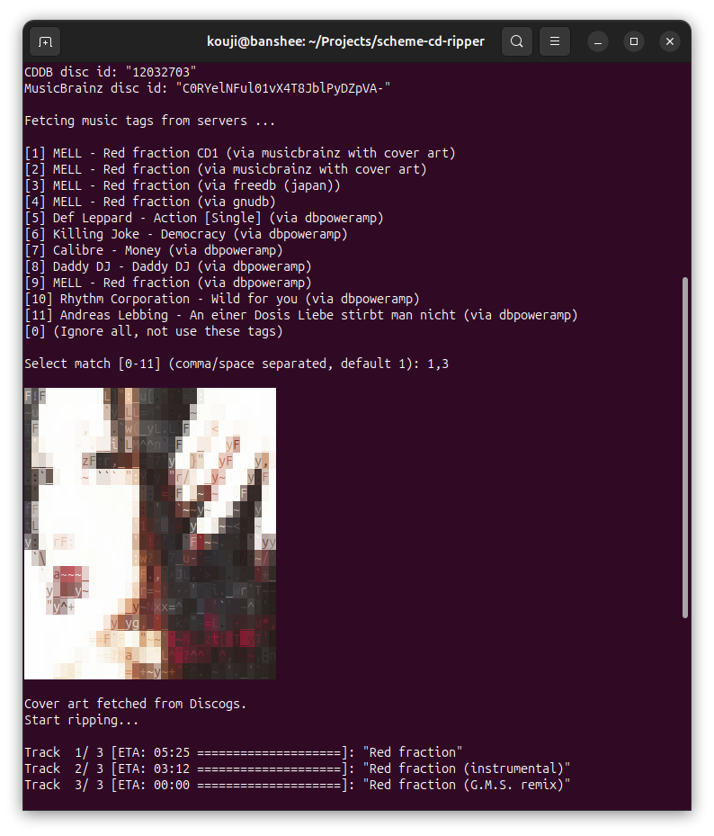
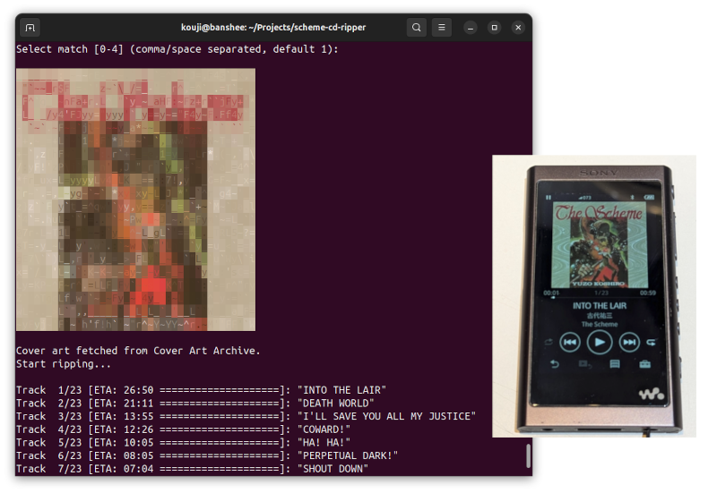

# Scheme CD music/sound ripper

Scheme CD Ripperは、オーディオCDをFLAC形式にリッピングするLinux用コマンドラインツールです。


[](https://www.repostatus.org/#active)
[](https://opensource.org/licenses/MIT)

配布パッケージ一覧(Debian/Ubuntu): https://github.com/kekyo/scheme-cd-ripper/releases

----

[(English language is here)](https://github.com/kekyo/scheme-cd-ripper)

## これは何？

Scheme CD Ripperは、オーディオCDをFLAC形式でリッピングするLinux用コマンドラインツールです。
複数のCDDBサーバーから自動的にメタデータを取得し、FLACファイルにタグを挿入します。

このワークフローは、大量のCDを連続的に処理し、アーカイブ用途に活用することを目的として設計されています。

### 機能

- 音楽ストリームの完全性チェック（`cd-paranoia`を使用）を実行しながら、オーディオトラックをFLAC形式でエンコード・保存します。
- ディスクのTOCを読み取り、複数のCDDBサーバーとMusicBrainzに照会します。一致した情報をすべて統合し、候補を選択することができます。更に、柔軟なメタデータ自動検索機能と候補の正規表現フィルタで、自動タグ付けの負担を軽減。
- Vorbis comments（FLAC形式のID3タグに相当）を自動挿入。さらにDiscogsやCAAにカバーアート画像が存在する場合、自動埋め込みが可能。
- 指定したタグによる書式でファイル名とディレクトリを自動生成。
- ファイル出力にGNOME GIO（GVfs）を使用するため、URL経由でNASなどのデバイスへ直接出力可能。
- 複数CDの効率的な処理のための連続モードをサポート。



-----

## インストール

Debian (trixie, bookworm) / Ubuntu (noble, jammy) では、[ビルド済みバイナリがここにあります](https://github.com/kekyo/scheme-cd-ripper/releases)。
パッケージは環境ごとに2種類 (`cdrip.deb`, `libcdrip-dev.deb`) がありますが、`cdrip`コマンドを使うだけなら前者のみインストールすればOKです。
後者はこの機能を使いたい場合の、C言語向けAPIライブラリです。

上記以外の環境の場合は、自分でビルドすることも可能です。その場合は [Self Building](https://github.com/kekyo/scheme-cd-ripper#self-building) を参照してください。

## コマンドの使用方法

デフォルトのオプションはcdripを簡単に使用できるように設定されています。
もちろん、以下のように好みに合わせて調整することも可能です:

```bash
cdrip [-d device] [-f format] [-m mode] [-c compression] [-w px] [-s] [-ft regex] [-nr] [-l] [-r] [-ne] [-a] [-ss|-sf] [-dc no|always|fallback] [-na] [-i config] [-u file|dir ...]
```

- `-d`, `--device`: CDデバイスのパス（`/dev/cdrom` など）。指定しない場合、利用可能なCDデバイスを自動検出して一覧表示します。
- `-f`, `--format`: FLAC出力ファイルパスの形式。`{}`内のタグ名を使用し、タグは大文字小文字を区別しません（後述）。
- `-m`, `--mode`: 整合性チェックモード: `best`（完全な整合性チェック。デフォルト）または `fast` (チェックを無効化)
- `-c`, `--compression`: FLAC圧縮レベル (デフォルト: `auto` (best --> `5`, fast --> `1`))
- `-w`, `--max-width`: カバーアートの最大幅（ピクセル、デフォルト: `512`）
- `-s`, `--sort`: CDDB検索結果をアルバム名順に並べ替えて表示。
- `-ft`, `--filter-title`: CDDB候補のタイトルを正規表現でフィルタ（大文字小文字無視、UTF-8）
- `-nr`, `--no-recrawl`: CDDBのタイトル候補でMusicBrainzを再検索しない
- `-r`, `--repeat`: 終了後に次のCDのリッピング作業を連続して行う。
- `-ne`, `--no-eject`: リッピング終了後もCDをドライブ内に保持する。
- `-a`, `--auto`: 完全自動モードを有効化（プロンプトなし）。
  メディアが挿入されている最初のドライブを選択し、CDDBの先頭エントリを選び、リピートモードではプロンプトなしでループする。
- `-ss`, `--speed-slow`: リッピング開始時にドライブの読込速度を等速(1x)へ要求する（デフォルト）。
- `-sf`, `--speed-fast`: リッピング開始時にドライブの読込速度を最大へ要求する。
- `-dc`, `--discogs`: Discogsのカバーアートの使用方法（`no`,`always`,`fallback`、デフォルト: `always`）。
- `-na`, `--no-aa`: カバーアートのANSI/ASCIIアート表示を無効化する。
- `-l`, `--logs`: デバッグログを出力する。
- `-i`, `--input`: cdrip設定ファイルのパス（デフォルト検索: `./cdrip.conf` --> `~/.cdrip.conf`）
- `-u`, `--update <file|dir> [more ...]`: 埋め込みタグを使用してCDDBから既存のFLACタグを更新（他のオプションは無視）

すべてのコマンドラインオプション（`-u` および `-i` を除く）は、`-i` で指定された設定ファイルの内容を上書きできます。

TIPS: MusicBrainzタグ付けで大量のCDを連続してインポートしたい場合は、`cdrip -a -r` オプションを指定することで実現できます。また、同じシリーズのCDをリッピングする場合は、 `-ft` オプションでタイトルをある程度絞り込んでおけば、CDDB候補の選択ミスを減らすことができます。

TIPS: いくつかのハードウェアメディアプレーヤーでは、圧縮レベルを6以上にすると誤動作を起こします。したがって、Scheme CD ripperのデフォルトは5となっています。

## CDDBタグの挿入

CDDBサーバー、またはMusicBrainzから楽曲の情報を自動的に取得して、トラック名を自動的に適用したり、
FLACのVorbis comments（FLACにおけるID3タグのようなもの）を追加したりすることができます。

また、複数のCDDBサーバーから得られた情報をマージすることもできます。複数の候補から一つまたはそれ以上の候補をカンマかスペースで区切って指定してください。
最初に指定された候補の番号が最も優先され、以降に続きます。ジャンルタグ（`genre`）は自動的に結合されます。

以下の例では、3と12の候補を順に適用します:

```bash
Fetcing from CDDB servers ...

[1] BarlowGirl - For the Beauty of the Earth (Studio Series) (via freedb (japan))
[2] Bomani "D'mite" Armah - Read a Book Single (via freedb (japan))
[3] Stellar Kart - Angel In Chorus (Studio Series) (via freedb (japan))
[4] Disney - Shanna (via dbpoweramp)
[5] Ladina - Verbotene Liebe (via dbpoweramp)
[6] Across The Sky - Found By You [Studio Series]  (2003) (via dbpoweramp)
[7] Bomani "D'mite" Armah - Read a Book Single (via dbpoweramp)
[8] Cuba Libre - Sierra Madre (via dbpoweramp)
[9] Big Daddy Weave - You're Worthy Of My Praise(Studio Series) (via dbpoweramp)
[10] BarlowGirl - For the Beauty of the Earth (Studio Series) (via dbpoweramp)
[11] Crossroads - Unknown (via dbpoweramp)
[12] Stellar Kart - Angel In Chorus (Studio Series) (via dbpoweramp)
[13] Tigertown - Wandering Eyes EP (via dbpoweramp)
[14] Jerry Smith - Twinkle Tracks (via dbpoweramp)
[15] DONALDO 22 - DONALDO22 (via dbpoweramp)
[0] (Ignore all, not use these tags)

Select match [0-15] (comma/space separated, default 1): 3,12
```

以下に挿入されるVorbis commentsを示します:

|キー名|内容|情報元|
|:----|:----|:----|
|`title`|音楽タイトル|CDDB,MusicBrainz|
|`artist`|アーティスト名|CDDB,MusicBrainz|
|`album`|アルバム名|CDDB,MusicBrainz|
|`genre`|ジャンル|CDDB,MusicBrainz|
|`date`|日付（決められていないフォーマット）|CDDB,MusicBrainz|
|`tracknumber`|トラック番号|internal|
|`tracktotal`|CD辺りのトラック数|internal|
|`albumartist`|アルバムアーティスト|MusicBrainz|
|`discnumber`|リリースパッケージ内のCD番号|MusicBrainz|
|`disctotal`|リリースパッケージのCD枚数|MusicBrainz|
|`media`|メディアフォーマット|MusicBrainz|
|`medium`|メディアタイトル（`musicbrainz_mediumtitle`の別名）|MusicBrainz|
|`releasecountry`|リリース国|MusicBrainz|
|`releasestatus`|リリース状況|MusicBrainz|
|`label`|ラベル名|MusicBrainz|
|`catalognumber`|カタログ番号|MusicBrainz|
|`isrc`|ISRC|MusicBrainz|
|`cddb`|取得したCDDBサーバー名|internal|
|`cddb_date`|CDDB情報を取得した日時（ISOフォーマット）|internal|
|`cddb_discid`|CDDBディスクID（CDDBサーバーから情報を再取得する際に必要）|internal|
|`cddb_offsets`|各トラックの開始オフセットリスト（CDDBサーバーから情報を再取得する際に必要）|internal|
|`cddb_total_seconds`|CD全体の時間（CDDBサーバーから情報を再取得する際に必要）|internal|
|`musicbrainz_release`|リリースMBID（MusicBrainzのリリース特定ID）|MusicBrainz|
|`musicbrainz_medium`|メディアMBID（MusicBrainzのメディア特定ID）|MusicBrainz|
|`musicbrainz_mediumtitle`|メディアタイトル（複数メディア時のみ、空の場合はVorbis commentにのみ`CD n`を挿入）|MusicBrainz|
|`musicbrainz_mediumtitle_raw`|メディアタイトル（raw、フォーマット専用。単一メディアでも使用可）|MusicBrainz|
|`musicbrainz_releasegroupid`|リリースグループMBID|MusicBrainz|
|`musicbrainz_trackid`|トラックMBID|MusicBrainz|
|`musicbrainz_recordingid`|レコーディングMBID|MusicBrainz|
|`musicbrainz_discid`|MusicBrainzディスクID（MusicBrainzからの情報取得に成功したら削除）|internal|
|`musicbrainz_leadout`|MusicBrainz CDリードアウト時間（MusicBrainzからの情報取得に成功したら削除）|internal|
|`discogs_release`|DiscogsリリースID（数値）|MusicBrainz|

CDDBやMusicBrainzから情報を得る場合、これらのすべてのタグ情報が得られるとは限りません。

Note: 心配する必要はありません。Vorbisコメントは通常大文字で記述されますが、この文書では単に小文字を使用しています。

## MusicBrainzとタグについて

- [MusicBrainz](https://musicbrainz.org/) は、構造化されたID、クレジット、ジャンル、リリースメタデータを提供するコミュニティ管理の音楽データベースです。
- CDDBサーバーは主にトラックタイトルなどのテキストフィールドを返しますが、MusicBrainzは正確なリリースレベルのメタデータと安定したIDを返すため、タグ付けの精度が向上します。
- Scheme CD ripperでは、`[cddb]`セクションの`servers`リストに`musicbrainz`を追加するだけで有効化できます。デフォルトのサーバーリストには既に含まれています。

### カバーアートの埋め込み

MusicBrainzから情報を取得した場合は、追加でカバーアート画像の取得を試みます。
プレイヤーがカバーアートの表示機能を持っていれば、カバーアート画像が表示されます:



- カバーアートの取得と埋め込みは、MusicBrainzのマッチングが使用された場合のみ可能です。他のCDDBサーバーはカバーアートを提供しません。
- `-dc`/`--discogs` で優先順を指定できます: `always`（デフォルト: Discogsを優先し失敗時にCAA）、`fallback`（CAA優先で失敗時にDiscogs）、`no`（Discogsを使用しない）。
- Discogsのカバーアートは、MusicBrainz release から `discogs_release` タグが取得できた場合のみ試行します。
- カバーアートは常にPNGフォーマットに再変換されます。
  これは、CAAから提供される画像フォーマットに特殊なメタデータ（ICCプロファイルなど）が含まれている場合があり、これがハードウェアメディアプレーヤーで画像を表示できないことに繋がります。
  PNGフォーマットなので、画像が老化することはありません（取り除かれるICCプロファイルでsRGBへの色空間変換が行われるので、その意味での「老化」はあります）。

## ファイル名のフォーマット

ファイル名フォーマットは、ディレクトリ名を含むあらゆるパス用のテンプレートであり、中括弧を用いてVorbis commentsのキー名から自動的に柔軟にパスを決定できます。

デフォルトは `"{album:n/medium:n/tracknumber:02d}_{title:n}.flac"` となっていて、アルバムとメディアタイトルでディレクトリが作られ、その中に `"01_foobar.flac"` のようなファイル名で保存されます。

以下にこのフォーマットの詳細を示します:

- 括弧 `{}` 内で、 `/` や `+` で複数キーを連結し、任意のパスやラベルを結合できます。
  - `/` でパス区切り、 `+` でスペースで結合します。例えば、 `"{album/medium/title}.flac"` と指定すると、アルバムタイトルとメディアタイトルがパス区切りで区切られ、 `"foobar/baz/intro.flac"` のようにサブディレクトリ内にファイルを配置できます。
  - 例: `"{album/medium}"` --> `"Album/Disc1"`
  - 例: `"{album+medium}"` --> `"Album Disc1"`
  - `"{album}/{medium}/{title}.flac"` のように括弧外で区切る場合、`album`や`medium`キーが存在しないと、パスがエラーとなります。しかし、括弧内で区切れば、キーが存在しない場合はパス区切りも追加されません（`+`によるスペース区切りも同様）。
- 文字列は、`:n`という書式指定で安全なパス名に変換できます。
  - パスとして不適切な文字をアンダースコアに置き換え、改行などが含まれる場合は、そこまでの文字列として区切ります。
  - 例: `"{title:n}.flac"`
- 数値は、 `:02d` のような書式指定で先頭ゼロを補間できます。
  - これはC言語の`printf`書式指定と似ていますが、サポートしている指定はこの形式のみです。
  - 例: `"{tracknumber:02d}.flac"` --> `"04.flac"`

その他に、以下のような機能があります:

- フォーマット後にディレクトリパスが含まれる場合は、そのディレクトリ群は自動的に作成されます。
- `.flac` 拡張子は省略すると自動的に付加されます。
- Scheme CD ripperはGNOME GIOをサポートしているため、リモートホストへの直接保存用URLを指定することも可能です（GVfsの設定が必要です）。
  - 例: `"smb://nas.yourhome.localdomain/smbshare/music/{title:n}.flac"`

### 既存のFLACファイルを埋め込まれたCDDBタグを使用して更新する

`-u`/`--update` オプションを使用すると、元のCDなしでリッピングしたFLACファイルのメタデータを更新できます:

```bash
# 単一のFLACファイル
cdrip -u album/01_track.flac

# 複数のパス（ファイルまたはディレクトリ。ディレクトリは再帰的に検索され、*.flac ファイルが検出されます）
cdrip -u album1 album2/track03.flac /path/to/archive
```

再取得を行うには、FLACファイルに以下のタグが含まれている必要があります（Scheme CD ripperでリッピングするとこれらのタグが自動的に挿入されます）:

- CDDBサーバーから再取得: `cddb_discid`,`cddb_offsets`, `cddb_total_seconds`
- MusicBrainzからの再取得（初回時）: `musicbrainz_discid`, `cddb_offsets`, `musicbrainz_leadout`
- MusicBrainzからの再取得（初回以外）: `musicbrainz_release`, `musicbrainz_medium`

CDDB候補の取得はリッピング時と同様の方法で行われます。希望する一致を対話的に選択する必要があります（自動モードを除く）。

## 設定ファイルフォーマット

Scheme CD ripperは設定ファイルを参照します。INI形式に似た形式です。

`cdrip.conf` (現在のディレクトリ) --> `~/.cdrip.conf`: この順序で最初に発見されたファイルが読み込まれます。
`-i`/`--input` オプションを使用してファイルを明示的に指定することもできます。

以下は設定ファイルの例です:

```ini
[cdrip]
device=/dev/cdrom
format={album:n/medium:n/tracknumber:02d}_{title:n}.flac
compression=auto     # auto または 0-8
max_width=512        # カバーアート最大幅(px、1以上)
speed=slow           # slow または fast（デフォルト: slow）
aa=true              # カバーアートをANSI/ASCIIアートで表示（TTYのみ）
discogs=always       # no / always / fallback（カバーアートの優先順。デフォルト: always）
mode=best            # best / fast / default
repeat=false
sort=false
filter_title=         # CDDB候補のタイトルを正規表現でフィルタ（未指定/空=フィルタなし、大文字小文字無視）
auto=false

[cddb]
servers=musicbrainz,freedb_japan,gnudb,dbpoweramp   # カンマ区切りのラベル

[cddb.gnudb]
label=gnudb
host=gnudb.gnudb.org
port=80
path=/~cddb/cddb.cgi

[cddb.dbpoweramp]
label=dbpoweramp
host=freedb.dbpoweramp.com
port=80
path=/~cddb/cddb.cgi

[cddb.freedb_japan]
label=freedb (japan)
host=freedbtest.dyndns.org
port=80
path=/~cddb/cddb.cgi
```

サーバーIDは`[cddb.<server_id>]`セクションで定義され、クエリは`[cddb]`セクションの`servers`で指定された順序で実行されます。
サーバーが設定されていない場合、組み込みの3つのサーバー（musicbrainz, gnudb, dbpoweramp）が使用されます。

特別なサーバーID `musicbrainz` は `[cddb.musicbrainz]` セクション定義を必要としません。

-----

## 備考

このソフトウェアにおいて、「CDDB」は特定の製品の用語を指すのではなく、「CDメタデータデータベース」を指します。

## ディスカッションとPR

ディスカッションは、 [GitHubのディスカッションページ](https://github.com/kekyo/scheme-cd-ripper/discussions) を参照して下さい。現在はissueベースのディスカッションを取りやめています。

## License

Under MIT.
